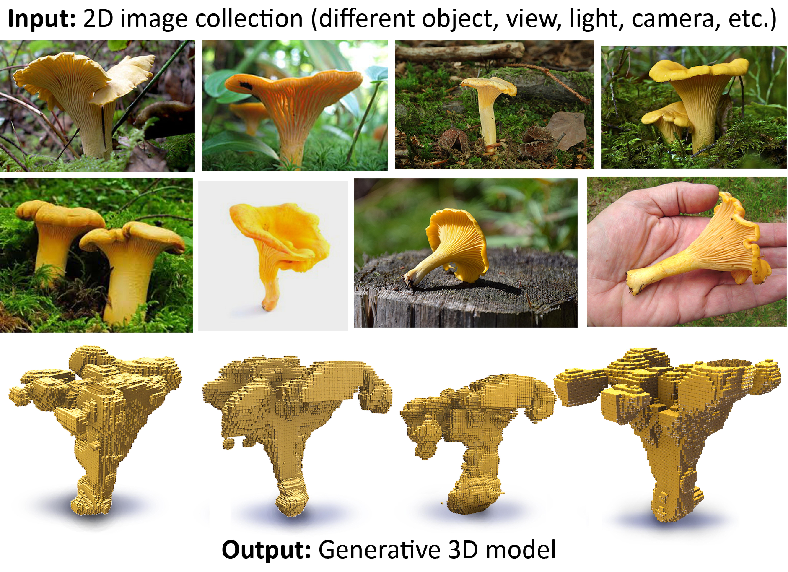

# PlatonicGAN


This repository contains code for the paper [Escaping Plato’s Cave: 3D Shape from Adversarial Rendering](https://geometry.cs.ucl.ac.uk/projects/2019/platonicgan/paper_docs/platonicgan.pdf) (ICCV2019). 

More detailed information and results can be found on our [project page](https://geometry.cs.ucl.ac.uk/projects/2019/platonicgan/).



## Data

For training you can use any image collection you would like. For now two example datasets "tree" and "chanterelle" are provided under 'datasets/. 
If you have your own data set go to 'scripts/data' and have a look at the already implemented custom implementations for data sets.
You may want to adjust them accordingly or create new ones.
In case you want to create a new `Dataset` class you should do so under `scripts/data`.


## Usage

### Prerequisites

- Linux (not tested for MacOS or Windows)
- Python3
- CPU or NVIDIA GPU

### Installation


Clone this repo:

```
git clone https://github.com/henzler/platonicgan
cd platonicgan
```

In order to install the required python packages run (in a new virtual environment):

```
pip install -r requirements.txt
```

*Note:* The model was trained with PyTorch 1.0.0, but also tested with Pytorch 1.3.1

### Train

For training execute the following command (for default config, currently this will train the tree dataset):

`python train.py`

or for a specific config:

`python train.py --config_file=scripts/configs/your_config_file.yaml`


### Track training progress

Use tensorboard to visualise intermediate training results:

`tensorboard --logdir=.`

## Bibtex

If you use this code for your research, please cite our paper.

 
```
@InProceedings{henzler2019platonicgan,
author = {Henzler, Philipp and Mitra, Niloy J. and Ritschel, Tobias},
title = {Escaping Plato's Cave: 3D Shape From Adversarial Rendering},
booktitle = {The IEEE International Conference on Computer Vision (ICCV)},
month = {October},
year = {2019}
}
```